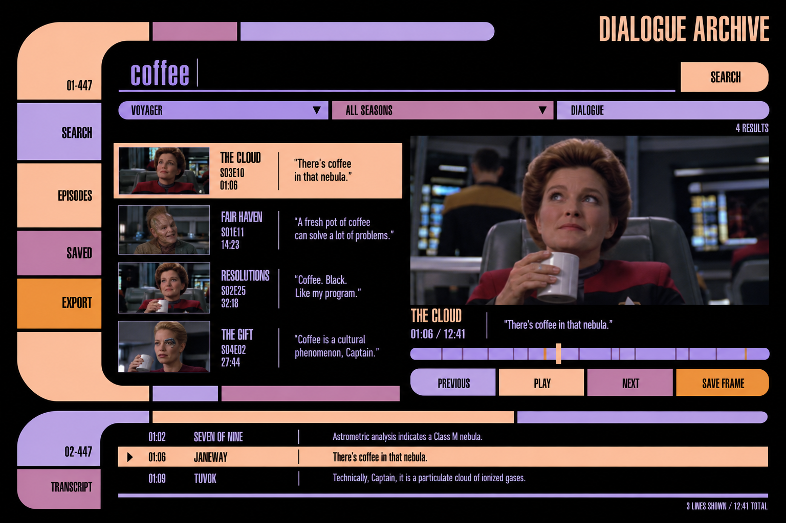
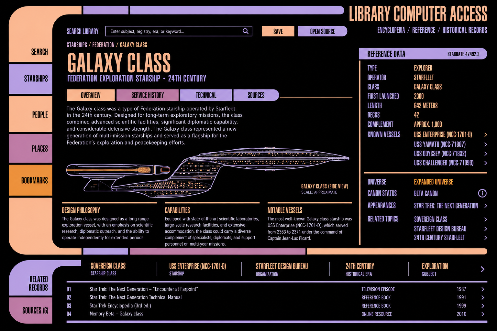
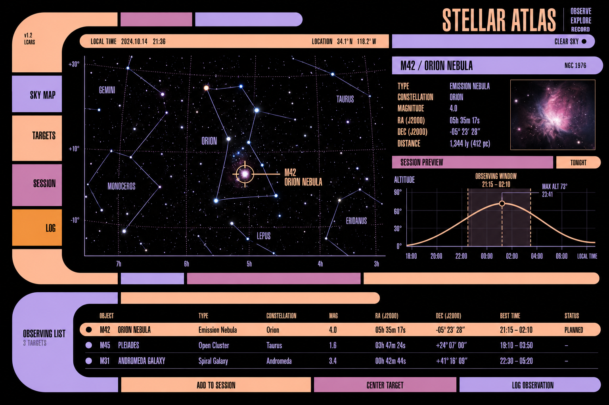
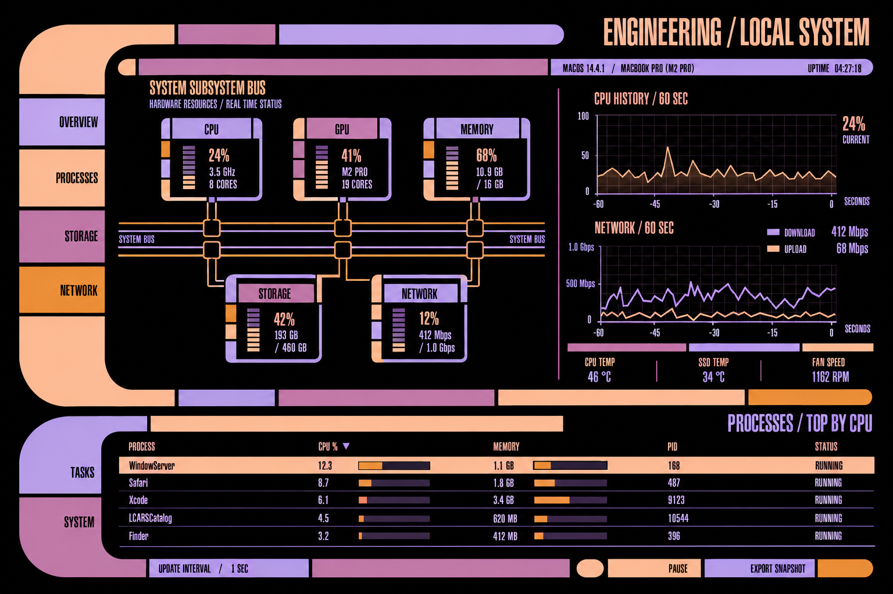

# LCARS application concepts

Four imagegen UI mockups exploring useful applications for the SwiftLCARS library.
Generated with the built-in image_gen tool, using the approved elbow/type and
TNG console PNG studies as visual references. Exact prompts are in [prompts.json](prompts.json).

These are design concepts, not screenshots of implemented applications or
verified production LCARS. Generated stills, episode metadata, quotations,
encyclopedia details, astronomy charts, and system readings are illustrative.
They must be replaced with sourced content before use in a working product.
In particular, the Dialogue Archive's episode numbers and transcript lines are
not reliable. The reference mockup's “beta canon” label should become a clear
“Expanded universe” source classification in the app.

## Dialogue Archive

A [Morbotron](https://morbotron.com/)-style episode dialogue and frame browser.
Core workflow: enter text, filter by series/season, select a result, inspect the
frame and transcript, scrub nearby context, save or export the selected record.

Library targets: search rail, filter segments, result rows with media, selection
band, timeline scrubber, transport controls, synchronized transcript, empty states.
A working sample should start with original fixture dialogue and images, with
an import boundary for user-supplied subtitle/media files.

## Reference Library

A Memory Beta-style encyclopedia reader. Core workflow: search, open an article,
follow related records, inspect citations, bookmark a page. The visual language
is TNG-inspired; expanded-universe subject matter stays explicitly attributed.

Library targets: article composition, breadcrumbs, section navigation, readable
body text, definition table, schematic placement, citation list, related records.
A sample can use original short articles without depending on a live wiki API.

## Stellar Atlas

An observing app for real astronomical objects. Core workflow: locate a target,
inspect its observing window, add it to a session, record an observation.

Library targets: pannable scientific canvas, callouts, time-series plots, table
selection, planned/completed states, session editor. Real charts require a star
catalog and time/location calculations; imagegen's map is not astronomical data.

## Engineering

A Mac system monitor. Core workflow: inspect resource usage, select a subsystem,
inspect processes, pause history, export a snapshot.

Library targets: schematic nodes/connectors, segmented meters, multi-series
history, sortable tables, update cadence and pause controls. A real implementation
must distinguish supported OS measurements from unavailable readings.

## Implementation direction

The science-console implementation supplies the first common foundations:

- `LCARSFrameMetrics`: shared elbow/spine/rail dimensions.
- `LCARSInstrumentHeader`: segmented rules with content-aware titles.
- `LCARSSequence`, `LCARSDataBank`, `LCARSIndicatorTrack`: coordinated optional motion.
- `LCARSSpectrum`: normalized plot with an accessible summary.
- Measured cap-height alignment and independently sized button symbols.

Next, build a complete app recipe from one mockup and extract its connected
secondary frames, search/selection controls, and data layouts into the library.
Keep generated pixels as visual targets; implement the interface as native
SwiftUI views with working controls and accessible content. Each recipe must
reflow into a PADD layout rather than scale down a desktop screenshot.
