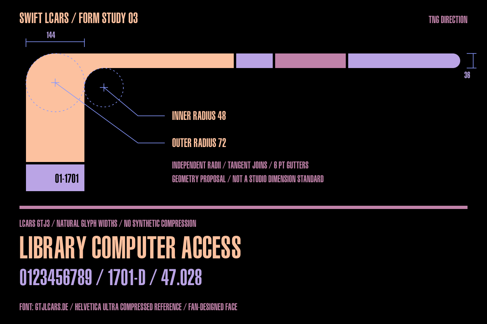

# Swift LCARS

A design system for building rich, native LCARS-inspired apps on Apple platforms.

**Status: initial SwiftUI implementation with a runnable sample app.** Supports macOS 14 and iOS/iPadOS 17 or later. TNG is the default visual direction.

The aim is a recognizable LCARS visual language—sweeping elbows, segmented rails, capsule controls, expressive color and technical data displays—with native navigation, accessible controls and layouts that adapt to their content.

## Start here

- [Package usage and sample app guide](Documentation/GettingStarted.md)
- Open **LCARSCatalog.xcodeproj** and run the **LCARSCatalog-iOS** or **LCARSCatalog-macOS** scheme.
- For a quick Mac launch: `swift run LCARSCatalog`.
- [Research and source provenance](Documentation/Research.md)
- [Design system proposal](Documentation/DesignSystem.md)
- [Machine-readable palette seeds](Design/palettes.json)

```swift
import SwiftLCARS

Button("Engage", action: engage)
    .buttonStyle(.lcars(.primary))
    .lcarsAnimated(.pulse)  // optional

LCARSActivityBand(.leftToRight, animated: true)
    .frame(height: 18)
```

## Included

- True circular elbows with independent radii, mirrored orientations and clamped geometry.
- Automatically registered LCARS GTJ3 display typography at its natural glyph widths.
- Six era palettes, plus a high-contrast preset and a readable typography mode.
- Native button/toggle styles, selection controls, sections, adaptive console composition, readouts and meters.
- Opt-in cycling digits, scrolling indicators in four directions, and pulse/scan modifiers for any shape or widget. Reduce Motion and inactive scenes pause ambient animation.
- An Observatory example with simulated scans, filtering, selection and export; a component catalog; and a motion playground.
- A real ActivityKit/WidgetKit Live Activity for iPhone. Tap the Dynamic Island to open the app's franchise picker; changing themes updates the activity.

## Selected direction: TNG

Warm, flat TNG-inspired LCARS is the visual anchor. Elbow geometry and typography are the first acceptance gates. The initial generated concept was rejected; the studies below replace it with explicit vector geometry and LCARS GTJ3 lettering at its natural widths.



- [Scalable elbow/type specimen](Design/elbow-type-outlined.svg)
- [Console composition study](Design/tng-console.png)
- [Scalable console study](Design/tng-console-outlined.svg)

These are the approved static design references, not screenshots of the sample app or exact reproductions of a production console. The library carries their geometry and fan-designed LCARS GTJ3 type into native SwiftUI.

## Platform scope

The first implementation targets macOS, iOS and iPadOS. watchOS, tvOS and visionOS need dedicated interaction examples before being advertised as supported. The sample's Xcode project includes a Live Activity extension; the Mac executable does not require ActivityKit.

Era styling, interaction state and information density are independent choices. An alert must not change a control's meaning, and changing a theme must not change an app's behavior.

## Attribution

LCARS was created by Michael Okuda for Star Trek. This is an independent, unofficial project. References are linked, not redistributed. The palette file identifies fan-source values and project-defined role assignments separately; none is presented as an official studio specification.

The unmodified LCARS GTJ3 font is included under its author's terms. See [third-party notices](THIRD-PARTY-NOTICES.md).

## TNG science console

The published sample now includes an annotated sensor map, target-linked spectra,
a simulated scan log, and coordinated LCARS animation. The reusable additions are
`LCARSFrameMetrics`, `LCARSInstrumentHeader`, `LCARSSequence`, `LCARSDataBank`,
`LCARSIndicatorTrack`, and `LCARSSpectrum`. See the [science console notes](Documentation/ScienceConsole.md)
and [API examples](Documentation/GettingStarted.md#coordinated-console-motion).

Four [application mockups](Design/AppConcepts/README.md) explore dialogue search,
a reference library, an astronomy atlas, and a Mac system monitor. They are visual
targets for future native app recipes, with exact generation prompts included.

## Dialogue Archive sample

The selected concept now has a [native SwiftUI recipe](Documentation/DialogueArchive.md):
search and episode filters, illustrated results, transcript scrubbing and playback,
saved lines, text export, and SRT import. It ships original demo dialogue and three
generated stills; playback advances the transcript, with no bundled video or audio.
